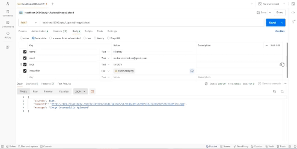

# Node.js File Upload Application

This Node.js application allows users to upload images and videos to the server using Express and the Express File Uploader middleware. Uploaded files are stored on Cloudinary, a cloud-based image and video management service. After a successful upload, an email is sent to the user with a link to the uploaded file.

## Features

- Upload images and videos to the server.
- Store files on Cloudinary.
- Send an email notification to the uploader with a link to the uploaded file.

## File Structure

The application consists of the following files:

1. `index.js`: Sets up the Express app, connects to the database and Cloudinary, and defines the endpoints for file upload.

2. `/routes/FileUpload.js`: Defines the routes for file upload, which include `imageUpload`, `videoUpload`, and `imageSizeReducer`.

3. `/models/File.js`: Defines the schema for the uploaded files and a post-save hook that sends an email to the user who uploaded the file.

4. `/controllers/fileUpload.js`: Contains the logic for handling file uploads, including checking file types, uploading to Cloudinary, and saving the file to the database.

## Installation

1. Clone the repository:

   \`\`\`bash
   git clone https://github.com/your-username/your-repo-name.git
   \`\`\`

2. Navigate to the project directory:

   \`\`\`bash
   cd your-repo-name
   \`\`\`

3. Install the dependencies:

   \`\`\`bash
   npm install
   \`\`\`

4. Set up your environment variables. Create a `.env` file in the root directory with the following variables:

   \`\`\`env
   CLOUDINARY_CLOUD_NAME=your_cloud_name
   CLOUDINARY_API_KEY=your_api_key
   CLOUDINARY_API_SECRET=your_api_secret
   MONGODB_URL=your_database_url
   EMAIL_HOST=your_email_host
   EMAIL_PORT=your_email_port
   EMAIL_USER=your_email_user
   EMAIL_PASS=your_email_password
   \`\`\`

5. Start the server:

   \`\`\`bash
   npm start
   \`\`\`

6. Access the application at `http://localhost:3000`.

## API Endpoints

### Image Upload

- **Endpoint**: `/upload/imageUpload`
- **Method**: `POST`
- **Description**: Uploads an image to the server and stores it on Cloudinary.
- **Request Body**: `Name, Tags, Email, Image(name:imageFile)`.

### Video Upload

- **Endpoint**: `/upload/videoUpload`
- **Method**: `POST`
- **Description**: Uploads a video to the server and stores it on Cloudinary.
- **Request Body**: `Name, Tags, Email, Image(name:videoFile)`.

### Image Size Reducer

- **Endpoint**: `/upload/imageUpload`
- **Method**: `POST`
- **Description**: Reduces the size of an uploaded image and stores it on Cloudinary.
- **Request Body**: `Name, Tags, Email, Image(name:imageFile)`.

## Email Notification

After a successful upload, an email is sent to the user with a link to the uploaded file. The email functionality is implemented using NodeMailer.

## Video Demonstration

## Acknowledgements

- [Express](https://expressjs.com/)
- [Cloudinary](https://cloudinary.com/)
- [NodeMailer](https://nodemailer.com/)
